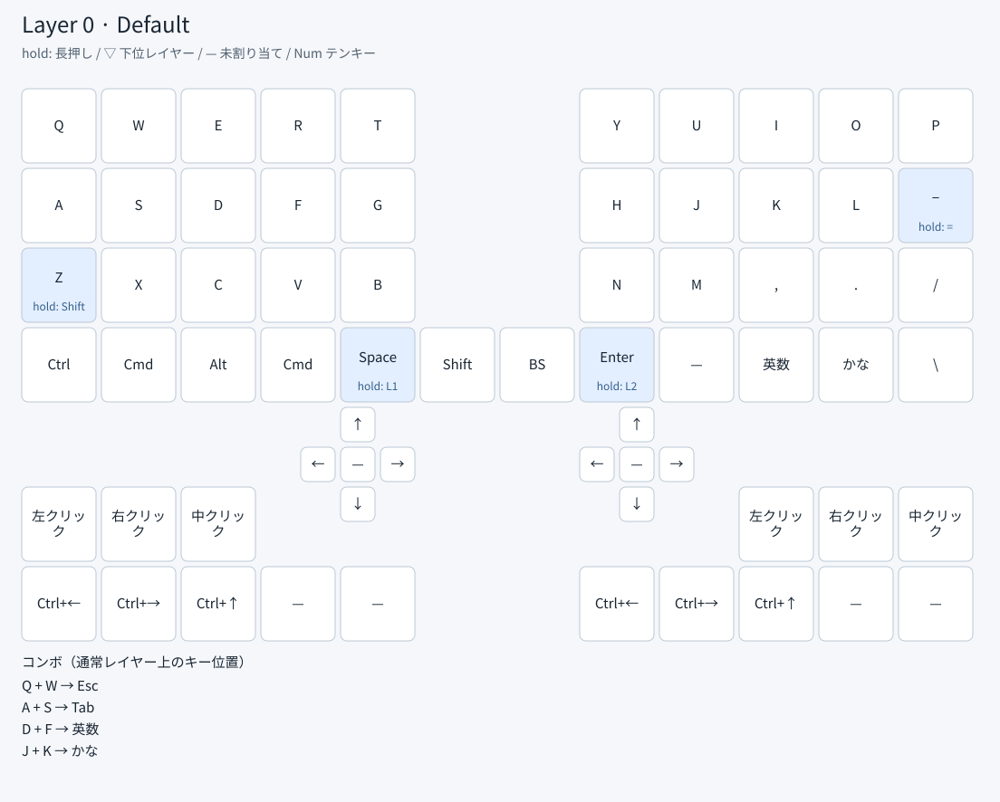
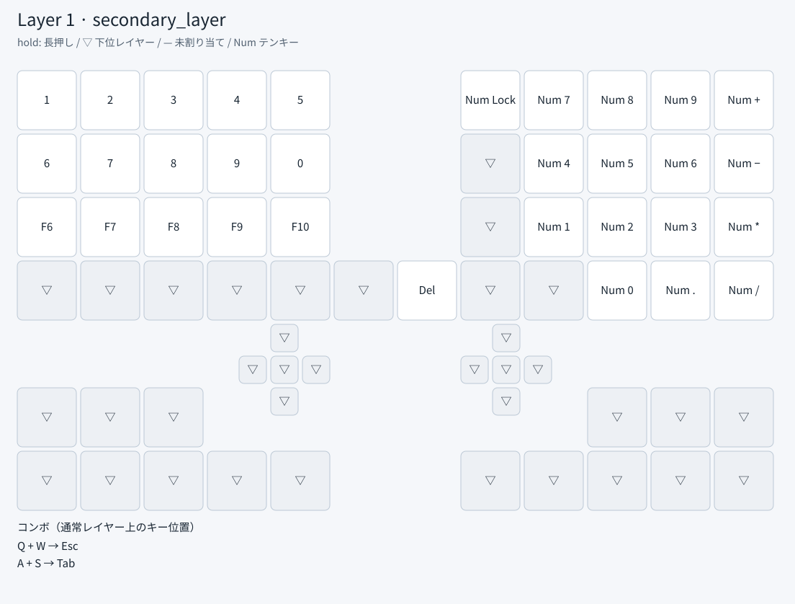
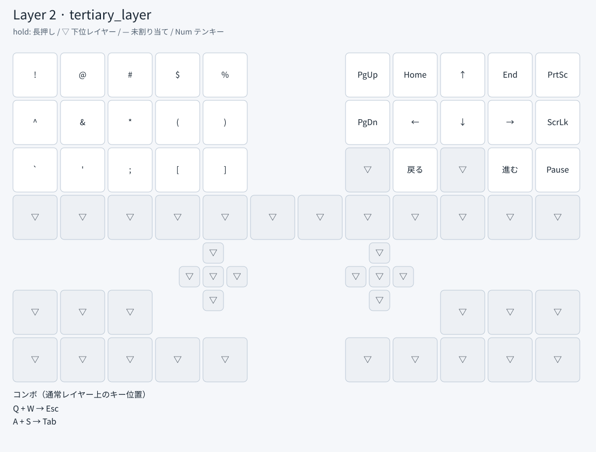
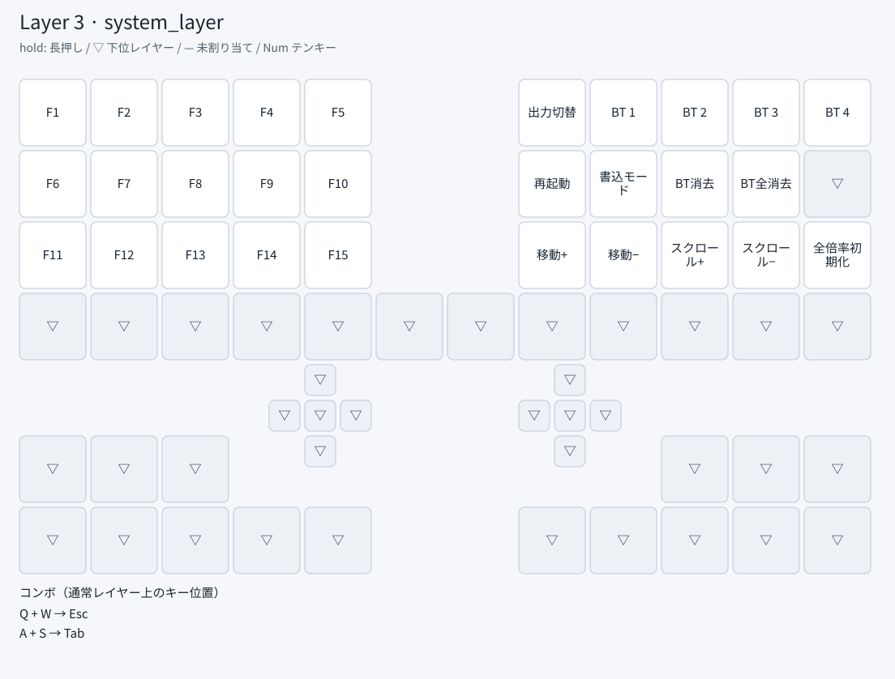

# LalaPad Gen2

LalaPad Gen2 用の ZMK ファームウェア設定です。

## トラックパッドの調整

Mac での追従性と細かな位置合わせを両立させるため、左右に同じ感度・フィルター設定を適用しています。以下は実機での比較を始めるための初期値です。Mac 純正トラックパッドと同じ特性や、実測した遅延の改善を保証するものではありません。

| 項目 | 変更前 | 現在 | 狙い |
| --- | --- | --- | --- |
| 通常のカーソル倍率 | 1/4 | 3/11 | 直前の設定より移動量を約9%増加 |
| レイヤー1・2のカーソル倍率 | 1/12 | 1/11 | 移動量を約9%増加し、通常の1/3の速度を維持 |
| 動的フィルターの低速／高速境界 | 30 / 511 | 10 / 180 | 指を動かしたときに平滑化を早めに弱める |
| 動的フィルターの低速時 Beta | 20 | 64 | 低速時の平滑化による追従遅れを抑える |
| 2本指スクロール開始の移動量 | 50 | 20 | スクロール開始までの空走を減らす |
| センサーとの I²C 通信 | 100 kHz | 400 kHz | センサーの読み取り時間を短くする |
| Bluetooth の peripheral latency | ホスト・左右間とも30 | ともに0を要求 | 接続イベントの省略を減らし、応答性を優先 |

カーソル倍率は macOS の加速処理より前の値です。スクロール倍率は通常1/12、レイヤー1・2では1/40を維持しています。1/40は1/4と1/10の2段階で処理し、各段階で小数に相当する余りを保持します。速度調整キーの倍率は固定倍率より先に適用し、速度を上げたときも小さな入力を生かします。レイヤー3は1・2の同時押しで入るため、低速モードが引き続き有効です。

Bluetooth の左右間隔は7.5 ms、Macへの希望間隔は7.5〜15 msで、従来の間隔を維持しています。今回変更したのは省略可能な接続イベント数です。実際のホスト接続条件はMacとの交渉で決まり、電波環境にも依存します。省電力待機を減らすため、電池の持ちは短くなる可能性があります。USBのポーリングはZMK既定の1 msです。右半分をUSB接続すると、MacまでのBluetooth経路を省いて比較できます。左半分から右半分への通信は引き続きBluetoothです。

1本指の移動、2本指の縦横スクロール、3本指の左右・上スワイプが使えます。左右どちらのトラックパッドでも、1本指タップは左クリック、2本指タップは右クリック、3本指タップは中央クリックです。全レイヤーで同じクリック割り当てを使います。タップドラッグ、ピンチ、カーソルとスクロールの慣性は無効です。スクロール方向とスワイプのキー割り当ては下のキー配置に対応します。

### 書き込み後の合わせ方

1. 左右両方のファームウェアを書き込みます。以前に調整した速度倍率は保存されているため、SpaceとEnterを長押ししてレイヤー3に入り、通常レイヤーの `/` の位置にある「全倍率初期化」を一度押します。Bluetoothのペアリング情報は消しません。
2. 同じMac・画面で、小さい対象への位置合わせ、ゆっくりした斜め移動、画面端までの移動、指を止めたときの追従を左右それぞれ確認します。低速モードでも小さな移動が失われないか確認します。
3. 速度はレイヤー3の `N` / `M` の位置で増減、スクロール速度は `,` / `.` の位置で増減できます（キー名は通常レイヤー基準）。倍率は保存されます。今回の感度上昇が大きすぎる場合は、初期化後に「移動−」を1回押して0.9倍にすると、直前の設定に近い移動量になります。
4. 2本指を置いただけでスクロールしないこと、軽く動かすと始まること、指を離すと止まることを確認します。1本指・2本指・3本指のタップで、それぞれ左・右・中央クリックになることを全レイヤーで確認します。3本指の左右・上スワイプと、無効にしているタップドラッグ／ピンチも確認します。

このファームウェアは相対移動とホイール入力を送るHIDマウスとして動作します。Mac側で追跡速度を調整する場合はマウス側の設定が対象です。純正トラックパッド固有の加速曲線・ピクセル単位のスクロール・Force Touchを再現するものではありません。スムーズスクロールの設定は有効ですが、HID Resolution Multiplierへの対応はホスト側に依存します。

調整箇所は `config/boards/shields/lalapadgen2/` の左右の `.conf` と共通の `lalapadgen2.dtsi` です。フィルターを弱めたことで静止時の微振動が気になる場合は、左右両方の `DYNAMIC_FILTER_BOTTOM_BETA` を64から32へ下げて再評価します。通信の途切れが生じた場合は、I²Cを100 kHzに戻して比較します。

設定の根拠： [IQS9150/IQS9151データシート §7.8・§12](https://www.azoteq.com/images/stories/pdf/IQS9150_IQS9151_datasheet.pdf)、[使用中ドライバー v1.0.0 の実装](https://github.com/ShiniNet/zmk-driver-iqs9151/blob/v1.0.0/drivers/input/iqs9151.c)、[ZMKの倍率処理](https://zmk.dev/docs/keymaps/input-processors/scaler)、[ZMK v0.3.0 のBluetooth設定](https://github.com/zmkfirmware/zmk/blob/v0.3.0/app/Kconfig)、[左右間のBluetooth設定](https://github.com/zmkfirmware/zmk/blob/v0.3.0/app/src/split/bluetooth/Kconfig)。

## キーレイアウト

画像は現在のファームウェア設定から生成しています。各画像の上側はメインキー、下側はタッチパッドの方向入力・クリック・ジェスチャーに対応するキー割り当てです。実機への反映にはビルドと書き込みが必要です。

- キー中央：短押し時の動作
- キー下部の `hold:`：長押し時の動作。レイヤーは押している間だけ有効
- `▽`：有効な下位レイヤーの割り当てを使用
- `—`：未割り当て
- `Num`：テンキー入力、`Cmd`：macOS の Command キー
- コンボ欄のキー名は通常レイヤー上の位置を表します。

通常レイヤーでは、Space の左隣が Command です。Space 長押しでレイヤー1、Enter 長押しでレイヤー2、両方の長押しでレイヤー3に切り替わります。通常レイヤーの D＋F は英数、J＋K はかな入力です。

<!-- keymap:start -->

<!-- Generated by scripts/render_keymap.py; do not edit this section. -->

### レイヤー 0 — Default



### レイヤー 1 — secondary_layer



### レイヤー 2 — tertiary_layer



### レイヤー 3 — system_layer



<!-- keymap:end -->

## レイアウトを変更したとき

**ファームウェアのキーレイアウトを変更したら、必ずこの README と配置画像も同時に更新してください。**

```sh
python3 scripts/render_keymap.py
python3 scripts/render_keymap.py --check
```

追加の Python パッケージは不要です。生成元は `config/lalapadgen2.keymap` と `config/lalapadgen2.json` です。新しい動作を導入する場合は、必要に応じて生成スクリプトの表示も対応させてください。画像を開いて内容・文字の重なりを確認し、変更した設定、画像、README を一緒にコミットします。

GitHub Actions でも画像と README が最新の設定に一致するか確認し、更新漏れがあれば失敗します。
